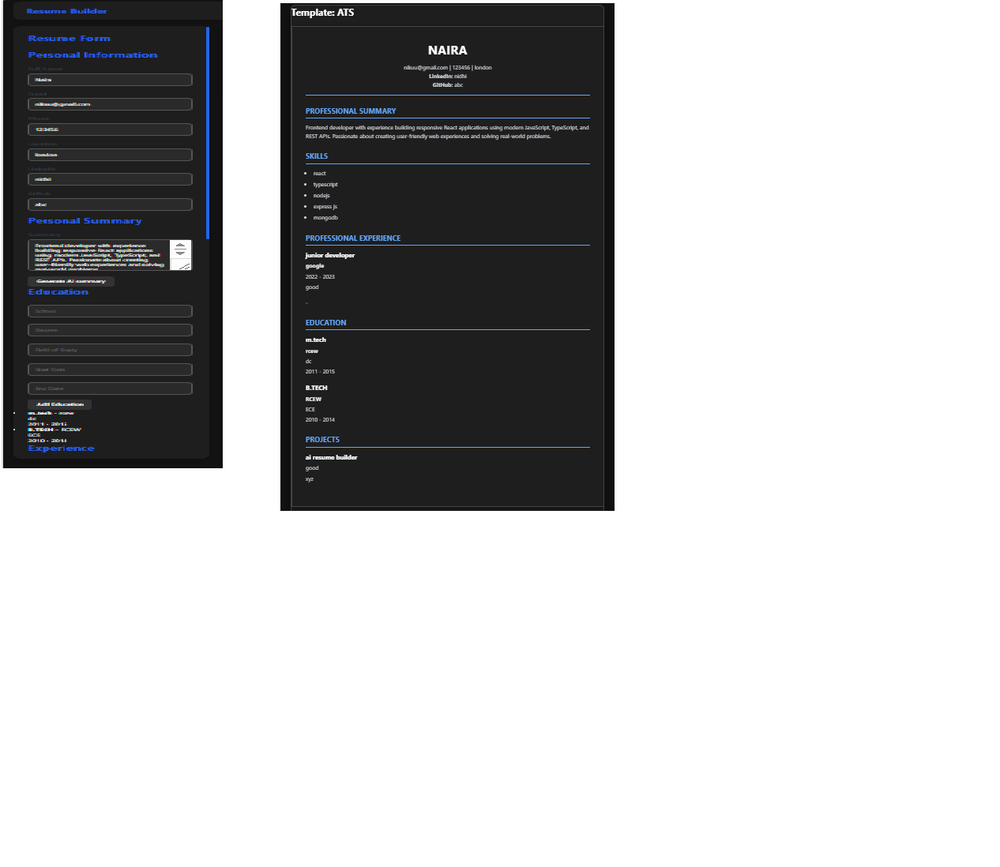
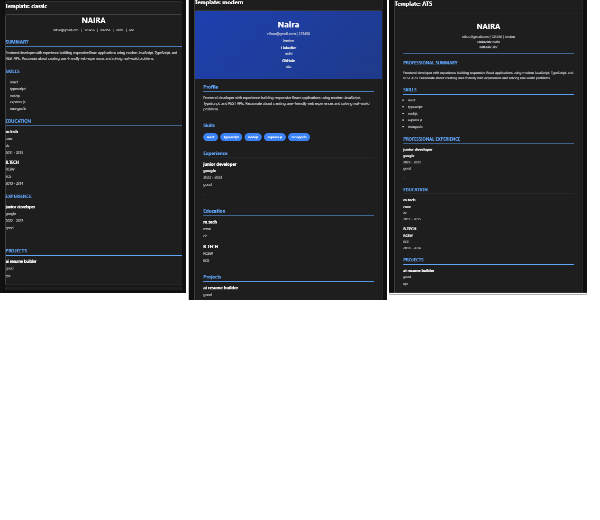
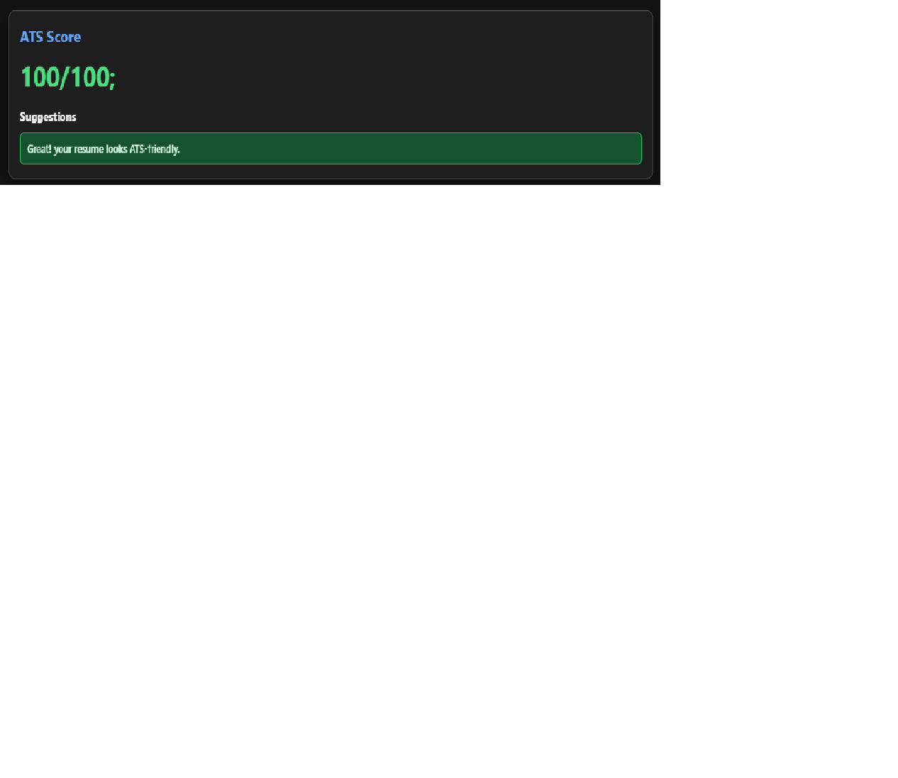
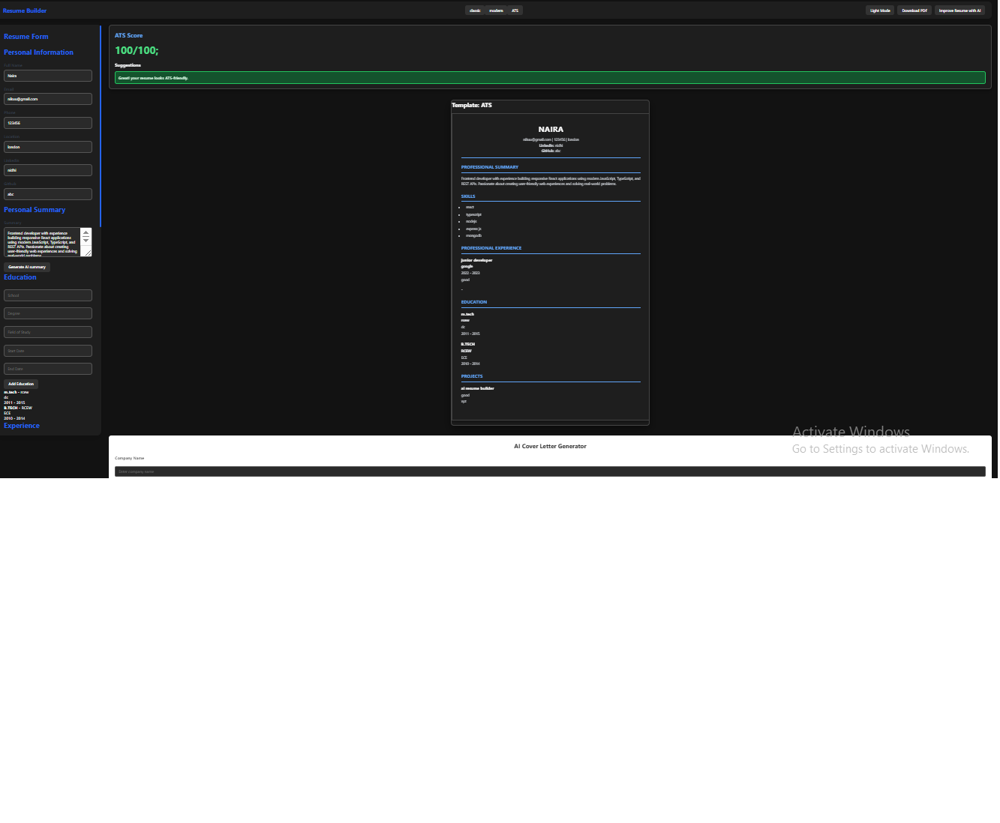

# AI Resume Builder 

An AI-powered resume builder built with React and TypeScript that helps users create professional resumes, check ATS compatibility, improve resume content with AI suggestions, and export resumes as PDF.

## Live Demo
Frontend: [AI Resume Builder](https://ai-resume-builder-v2-delta.vercel.app)


## Features

### Resume Creation
- Create resumes with personal information, education, experience, skills, and projects
- Real-time resume preview
- Multiple resume templates:
  - Classic Template
  - Modern Template
  - ATS Friendly Template

### AI Features
- AI-powered resume improvement suggestions
- AI-generated resume summary
- Loading states and error handling for AI requests

### ATS Resume Checker
- Checks resume content for ATS compatibility
- Provides suggestions to improve resume quality
- Displays ATS score

### Customization
- Dark mode support
- Template switching
- Responsive UI design

### Export
- Download resume as PDF

### Data Storage
- Resume data is stored using browser Local Storage
- No account required

---

# Tech Stack

## Frontend

- React.js
- TypeScript
- Vite
- CSS3
- HTML2Canvas
- jsPDF

## Backend

- Node.js
- Express.js
- Groq API integration

## Tools

- Git & GitHub
- VS Code

---

# Project Structure

```
ai-resume-builder/

├── src/
│   ├── components/
│   │   ├── resume/
│   │   ├── templates/
│   │   ├── ats/
│   │   └── coverLetter/
│   │
│   ├── pages/
│   │   └── ResumeEditor.tsx
│   │
│   ├── styles/
│   │
│   ├── types/
│   │
│   └── utils/
│
├── server/
│   ├── server.js
│   └── routes/
│
└── package.json
```

---

# Installation and Setup

## Clone Repository

```bash
git clone https://github.com/nidhi-baberwal/ai-resume-builder-v2.git
```

Go inside project folder:

```bash
cd ai-resume-builder
```

---

## Frontend Setup

Install dependencies:

```bash
npm install
```

Run frontend:

```bash
npm run dev
```

Application will run on:

```
http://localhost:5173
```

---

## Backend Setup

Go to server folder:

```bash
cd server
```

Install dependencies:

```bash
npm install
```

Create `.env` file:

```
PORT=5000
GROQ_API_KEY=your_api_key
```

Start backend:

```bash
node server.js
```

Backend runs on:

```
http://localhost:5000
```

---

# Deployment

## Frontend
- Vercel

## Local Development

Frontend:
http://localhost:5173

Backend:
http://localhost:5000

#  Screenshots

## Resume Editor



## Resume Templates



## ATS Score Checker



## Dark Mode



---

# Future Improvements

- User authentication
- Cloud resume storage
- PostgreSQL database integration
- Resume history
- More professional templates
- Job description based resume optimization

---

# Learning Outcomes

Through this project I learned:

- Building scalable React components
- TypeScript interfaces and type safety
- Managing complex form state
- Creating reusable components
- Working with APIs
- PDF generation in React
- AI API integration
- Responsive UI design

---

#  Author

**Nidhi**

GitHub:
https://github.com/nidhi-baberwal

---

⭐ If you like this project, consider giving it a star!